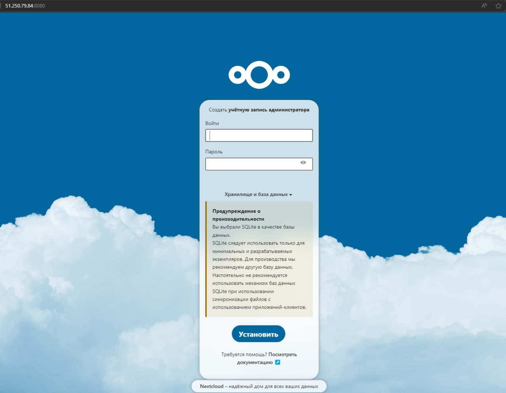
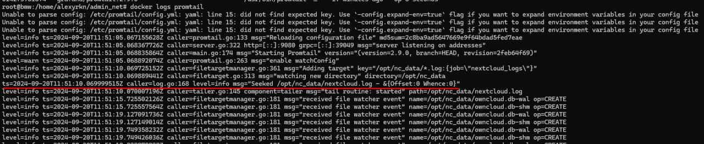
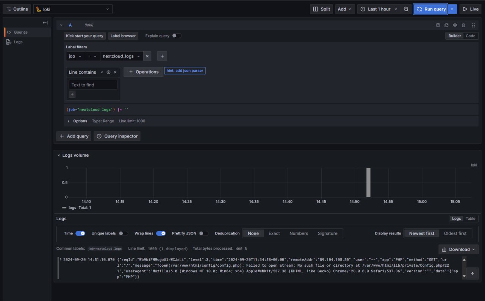

# Лабораторная работа №1

### Выполнение:

1. Подняли контейнеры с помощью docker compose

2. Создали админа на nextcloud

3. Проверили логи nextcloud

4. Проверили, что promtail собирает логи nextcloud

5. Добавили nextcloud доверенный домен

6. Подняли Zabbix, добавили туда темплейт и хост с этим темплейтом

7. Добавили в графану data source Loki

8. Добавили в графану data source Zabbix

9. Создали дашборды на статус nextcloud и логи

### Ответы на вопросы:
1. Чем SLO отличается от SLA?

SLO - желаемое/целевое значение конкретной метрики, которая описывает уровень доступности услуги
SLA - соглашение, описывающее уровень качества предоставленной услуги
Кратко: SLO — это цель, SLA — это соглашение, включающее эти цели.

2. Чем отличается инкрементальный бэкап от дифференциального?

Инкрементальный бэкап сохраняет изменения с последнего любого бэкапа, дифференциальный — с последнего полного.

3. В чем разница между мониторингом и observability?

Мониторинг — это часть observability. Мониторинг отслеживает известные показатели, а observability уже отслеживает их корреляцию и произоводит диагностику не одного конкретного показателя, а всей системы целиком.