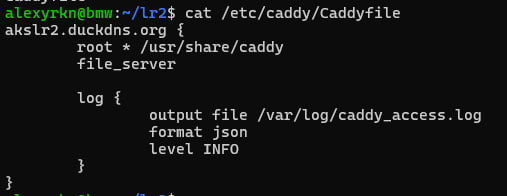

# Лабораторная работа №2

## Выполнение:

1. Проверяем, что сервер с Ansible подключился к “клиенту”

2. Пробуем выполнить команду посложнее на нашем клиенте

3. Установка Caddy


4. Запускаем плейбук: ansible-playbook caddy_deploy.yml и проверяем, успешно ли все шаги выполнились

5. Регистрируем себе бесплатный домен на ip-адрес ВМ на сервисе duckdns.org

6. Снова запускаем обновленный плейбук

7. Проверяем Caddyfile


8. Убеждаемся, что тестовая страничка Caddy автоматически поднялась на подписанном сертификате с https


## Задания:
### 1. Переписать пример с созданием и удалением файла из шага 5 Части 1 с ad-hoc команд на плейбук формат, а так же добавить четвертый шаг - перед удалением поменять содержимое файла на любое другое.

[Обновленный плейбук](./sources/task1_playbook.yml)

Пример работы плейбука


### 2. “Расширить” конфиг вебсервера Caddy любым функционалом по желанию: например, добавить проксирование, или какие-нибудь заголовки (header). Вместо дефолтной страницы Caddy подставить свою, хотя бы index.html с Hello world внутри. Добавить это в качестве дополнительного шага в tasks

[Обновленный Caddyfile.j2](./sources/Caddyfile.j2)

[Обновленный tasks/main.yml](./sources/main.yml)

Добавили:

В конфигурационный файл Caddy проксирование и хедеры, а также изменили путь до отображаемой страницы:

```
{{ domain_name }} {
        root * /var/www/html
        file_server

        log {
                output file {{ log.file }}
                format json
                level {{ log.level }}
        }

        header / {
          X-Custom-Header "Hello from Caddy"
        }

        reverse_proxy /api/* localhost:3000
}
```

В шаги tasks добавили:

Создание директории и страницы index.html:

```yaml
- name: Create /var/www/html directory
  file:
    path: /var/www/html
    state: directory
    owner: www-data
    group: www-data
    mode: '0755'

- name: Create custom index.html
  copy:
    content: |
      <html>
        <head>
          <title>LR2</title>
        </head>
        <body>
          <h1>Hello World from beer nutritionists!</h1>
        </body>
      </html>
    dest: /var/www/html/index.html
    owner: www-data
    group: www-data
    mode: '0664'
```

Пример работы:

